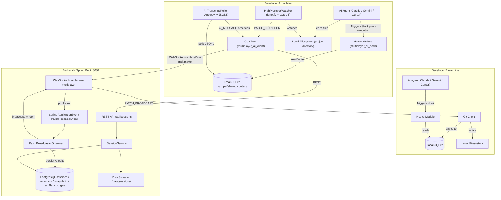

# Multiplayer AI

> **Enable multiple developers to work with their own local AI coding agents while sharing a synchronized workspace and a persistent, locally-owned engineering context.**

---

## 🎯 Why I Built This

The idea for Multiplayer AI started with a **Y Combinator Request for Startups** focused on multiple people collaborating with an AI agent while sharing the same context.

I found the problem interesting because it combines **AI agents, collaboration, and distributed systems**. I decided to attempt building it by exploring a local-first approach:

> **What if the shared context lived on users’ local machines and was synchronized between them?**

This led me to build a coordination layer that synchronizes filesystem changes, maintains shared AI context, and allows multiple clients to participate in the same session while continuing to use their preferred local AI tools.

Through this attempt, I explored challenges including **real-time synchronization, event ordering, missed-event recovery, concurrent changes, and maintaining consistent state across clients**.

The goal was to investigate whether multiple local AI workflows could behave like a shared, multiplayer AI session.


---

## 💡 What It Does

Describe the project's capabilities from a user's/problem-solving perspective.

* **Real-time Workspace Sync:** Detects local file changes recursively via `fsnotify` and propagates line-level diffs to all participants over WebSockets, keeping workspaces synchronized in real-time.
* **AI vs. Human Change Attribution:** Inspects OS process locks to determine if changes were made by a human developer or an AI agent (e.g., Cursor, Claude, Antigravity) and tags the broadcasted patch with the modifier.
* **Shared Engineering Context:** Maintains a local-first SQLite database of conversation transcripts and file changes on each machine, synchronizing the history dynamically when new members join.
* **Workspace AI Hooks Integration:** Integrates with coding agents using local post-invocation lifecycle hooks (`.agents/hooks.json` and Go-based `HooksModule`). After an AI tool executes, the hook runs to query the shared SQLite context and dynamically inject the latest transcript messages or updates back into the agent's view.
* **Workspace Rule Injection:** Dynamically writes configuration rules (like `.cursorrules`, `.clinerules`, `.cursor/rules/multiplayer.mdc`, and `.agents/hooks.json`) when joining a session, directing the user's AI to consult the shared context before acting.
* **Flexible Initialization Protocol:** Automatically aligns developers on Git branches or handles secure ZIP snapshot transfers (with Zip Slip path traversal checks) for non-Git projects.

---

## 🏗️ Architecture

Show the system at a high level.



### Key Components

| Component | Responsibility |
| --- | --- |
| **Go Client (`multiplayer_ai_client`)** | Handles recursive directory watching, LCS line-diff calculation, patch application, and local SQLite data storage. Runs background tasks like transcript polling. |
| **Spring Boot Backend** | Serves as the central command-and-control server. Implements session REST APIs, manages WebSocket connections and room subscriptions, tracks active member presence, and handles ZIP snapshot storage. |
| **Local SQLite Database** | A low-latency local database storing session metadata, message transcripts, and file change logs so local AI agents can access context instantly without network latency. |
| **PostgreSQL Database** | Persistent storage for backend metadata, including active session configurations, member roles/presence, zip snapshot versions, and AI file change audit logs. |
| **Hooks Module (`multiplayer_ai_hook`)** | A CLI hook triggered after IDE/agent execution. Locates session context and injects ephemeral messages or shared database updates back into the local agent's workspace. |

---

## 🧠 Engineering Decisions

This is one of the **most important sections for a resume project**.

### Why Go for the Client?
Go was chosen for the client application due to its portability, performance, and low-level system integration capability. It compiles into a single, dependency-free binary, which simplifies local deployment and integration with IDEs. Using `fsnotify` allows us to recursively monitor the filesystem with minimal OS resources, and Go's concurrency model (goroutines and channels) handles high-frequency WebSocket messaging and file watching efficiently.

### Why Spring Boot for the Backend?
The backend needs a robust, scalable structure to manage session states, multipart snapshot uploads, and real-time messaging. Spring Boot provides first-class support for WebSockets, standard REST APIs, and an in-process event bus (`ApplicationEvent`). This allows us to cleanly decouple message reception from database persistence and broadcast logic via the Observer pattern.

### Why Architecture Y? (Local-first SQLite + WebSocket Relay)
Instead of centralizing the session's AI conversation logs on a remote server, we synchronize and query them from local SQLite databases:
* **Microsecond Reads:** The local post-invocation hook queries the context database. Reading from local SQLite takes microseconds, whereas remote API queries would introduce hundreds of milliseconds of latency, avoiding delays in workspace updates.
* **Privacy:** AI conversation content remains on developers' local machines. The central server only relays patches and logs metadata, never storing full conversational reasoning steps.
* **Offline Access:** Developers can review local workspace history and run code changes even during intermittent network disconnections.

### Trade-offs
* **LCS Diffs vs. Whole-File Overwrites:** Computing line-level Longest Common Subsequence (LCS) diffs adds CPU overhead on the client, but it keeps WebSocket payloads extremely small. We trade slight compute on the developer's machine for minimal bandwidth usage and faster remote sync.
* **Last-Write-Wins (LWW) vs. Operational Transformation (OT):** To keep the implementation practical, we use an ignore-window to prevent echo loops and resolve conflicts via LWW. While OT provides concurrent collaborative editing, it adds massive complexity. Since developers usually work on separate files or coordinate using the AI's shared context, LWW is a practical compromise.

---

## 🔥 Interesting Engineering Problems

Highlight the parts that were genuinely difficult or interesting.

### Problem 1 — AI vs. Human Change Attribution

**Challenge:**
The local filesystem watcher triggers on every file write, but we must distinguish between edits made by the developer and those made by the local AI agent (and identify which agent, e.g., Cursor, Claude, Antigravity). Without this, we cannot flag patches with `isAiEdit` or log context appropriately.

**Approach:**
Upon detecting a file modification, the watcher queries the operating system's process table to check which active processes hold a write lock on the modified file. It resolves the process name and compares it against a known list of AI tool process executables (such as `claude.exe`, `cursor.exe`, `antigravity.exe`).

**Why this approach:**
It avoids having to build plugins for every individual IDE or agent. Using non-intrusive OS-level process locking inspects the system state transparently without changing developer toolchains.

---

### Problem 2 — Echo Loop Suppression in Filesystem Synced Workspace

**Challenge:**
When Client A modifies a file, it broadcasts the patch to Client B. When Client B applies the patch by writing the file to disk, Client B's filesystem watcher fires. Without intervention, Client B would broadcast the same change back to Client A, causing a recursive, infinite network storm (echo loop).

**Approach:**
We implemented an incoming patch ignore-window. When Client B writes a received remote patch to disk, it registers that file path in a temporary thread-safe cache with a 2-second ignore TTL. The local watcher checks this cache before processing any write events, skipping any matches.

**Result:**
It provides a simple, stateless solution to the echo loop problem without needing distributed locks or central sequence ordering on the backend.

---

## ⚡ Performance / Results

Quantify things wherever possible.

| Metric | Result |
| --- | --- |
| **Average Sync Latency** | < 100ms (LAN / Localhost WebSocket loop) |
| **Polling Frequency** | 1.5 seconds (Antigravity conversation log) |
| **Echo Suppression Window** | 2.0 seconds |
| **Max Snapshot File Size** | 5 MB (Multipart zip for non-Git workspace) |
| **Active Session Limit** | Max 10 active sessions per owner |
| **Join Context Sync Limit** | Chronological replay of last 100 AI messages |

---

## 🛠️ Tech Stack

**Languages:** Go, Java

**Backend:** Spring Boot 4.1.0, Spring Web MVC, Spring WebSocket

**Databases:** PostgreSQL (Backend metadata), SQLite (Client local-first shared context)

**Libraries & Protocols:** Workspace Agent Hooks, `fsnotify` (Go file watching), Lombok, JDBC / JPA

**Workspace Tools:** Git integration, ZIP compression utilities

---

## 🔄 How It Works

Explain one representative flow from beginning to end.

```text
File Changed (User/AI Edit)
             ↓
Watcher Detects Event (fsnotify)
             ↓
Modifier Attributed (Process Lock Check)
             ↓
LCS Line Diff Computed
             ↓
PATCH_TRANSFER Sent (WebSockets)
             ↓
Backend Relays Message (Observer Event Bus)
             ↓
PATCH_BROADCAST Received by Peer
             ↓
Ignore Window Applied (Echo Suppression)
             ↓
Patch Written to Disk & Logged in SQLite
```

1. **Change Detection:** A file within the workspace is modified (either by the user or an AI agent). The Go client's `HighPrecisionWatcher` detects the change via recursive `fsnotify` events.
2. **Attribution & Diffing:** The client queries the OS to check if an AI process holds a lock on the file. It then computes the exact line differences using a Longest Common Subsequence (LCS) algorithm.
3. **Transmission:** The client wraps the patch details (including file delta, attribution, and timestamp) in a `PATCH_TRANSFER` JSON payload and sends it over the active WebSocket room.
4. **Relay & Persistence:** The Spring Boot backend receives the message, publishes a `PatchReceivedEvent`, and routes the message to all other participants subscribed to the session. If the edit was made by an AI, it is also logged in PostgreSQL for audit purposes.
5. **Application:** Other connected clients receive the `PATCH_BROADCAST` message. They add the target path to their ignore-window to prevent echo loops, apply the patch line-by-line to the local filesystem, and insert a log of the edit into their local SQLite database for context tracking.

---

## 🚀 Running Locally

### Prerequisites

* Java 21 JDK
* Maven 3+
* Go 1.21+
* PostgreSQL server (running locally on port 5432)

### Setup

```bash
git clone https://github.com/888Sourav888/Multiplayer_AI_System.git
cd Multiplayer_AI_System
```

### Configuration

#### Backend Service Configuration
Configure your database connection inside `service/src/main/resources/application.properties`:
```properties
spring.datasource.url=jdbc:postgresql://localhost:5432/MultiplayerAI
spring.datasource.username=postgres
spring.datasource.password=mydatabase
server.port=8080
app.storage.base-dir=./data/sessions
```
*Create the database `MultiplayerAI` in your PostgreSQL instance before launching.*

#### Client Configuration
Edit `client/config.json` next to the client binary directory:
```json
{
  "lowerEnvBackendURL": "http://localhost:8080",
  "prodBackendURL": ""
}
```

### Run

#### 1. Start the Backend Service
```bash
cd service
./mvnw spring-boot:run
```

#### 2. Compile the Hook Module
The hook module must be compiled to an executable within the workspace so client session rules can trigger it post-invocation:
```bash
cd ../HooksModule
go build -o multiplayer_ai_hook.exe
```

#### 3. Build & Launch the Client CLI
Compile and run the Go client to join or create sessions:
```bash
cd ../client
go build -o multiplayer_ai_client.exe
./multiplayer_ai_client.exe --user alice
```

---

## 📁 Project Structure

```text
Multiplayer_AI_System/
├── client/                      # Go Client codebase
│   ├── contextengine/           # SQLite context sync and logging
│   ├── menu/                    # Interactive CLI menu & REST client
│   ├── session/                 # fsnotify watcher & patch applier
│   ├── ui/                      # ANSI terminal styling elements
│   ├── config.json              # Client backend settings
│   └── main.go                  # Client entry point
├── service/                     # Spring Boot Backend codebase
│   ├── src/
│   │   ├── main/
│   │   │   ├── java/            # Spring controllers, services, handlers
│   │   │   └── resources/       # Application configuration & static assets
│   │   └── test/                # JUnit & Spring Integration tests
│   └── pom.xml                  # Maven build configuration
├── HooksModule/                 # Post-invocation hooks for IDE/agent injection
└── database_entities.md         # Database schema descriptions
```

Briefly explain only the important directories:
* `client/`: Hosts all Go source files responsible for the user client CLI, process detection, and file synchronizer.
* `service/`: Contains the Java Spring Boot application implementing WebSocket logic, persistence triggers, and CRUD REST APIs.
* `HooksModule/`: Handles post-invocation routines written in Go to intercept and inject ephemeral context into local IDE rules.

---

## 🧪 Testing

Describe the testing strategy.

### Running Backend Tests
Execute the JUnit test suite via Maven:
```bash
cd service
./mvnw test
```

* **SessionServiceTest:** Validates session creation, user joining, snapshot versioning, and owner limit checks.
* **ServiceApplicationTests:** Verifies application context loading and auto-configuration.
* **stomp-test.html:** Web-based interface located in `service/src/main/resources/static` to manually verify WebSocket and STOMP message broadcasting.

---

## 🔮 Future Improvements

Only mention **realistic extensions**.

* **Patch Ordering & Causal Guarantees:** Implement server-side sequence numbering or vector clocks to guarantee correct causal ordering when multiple developers edit concurrently.
* **Missed-Event Replay:** Build a checkpoint-based event log on the server so that clients reclaiming connection after a network drop can catch up on missing patches.
* **Cross-Instance Event Routing:** Integrate Redis Streams to support routing WebSocket broadcasts across multiple containerized instances of the Spring Boot backend.
* **Change Voting/Approval Workflows:** Add a CLI/UI prompt allowing developers to approve or reject incoming AI edits before they are automatically applied to their active directories.

---

## 📚 What I Learned

This is optional, but useful for personal projects.

* **Designing Idempotent Sync Pipelines:** Designed local-first replication patterns using SQLite `INSERT OR IGNORE` and transaction logs to synchronize agent memories without duplicate side-effects.
* **OS-Level Process Locking Inspection:** Interfaced with Windows and Unix system APIs in Go to inspect filesystem lock ownership, achieving process-level attribution of edits in real time.
* **Handling Concurrent State Updates:** Designed stateful debounce and path-ignore windows to break infinite broadcast loops in peer-to-peer workspace replication.
* **Decoupling Event-Driven Systems:** Utilized Spring `ApplicationEvent` and Observer patterns to decouple WebSocket broadcast loops from transactional persistence pipelines.

---

## 👨💻 Author

**Sourav**

[LinkedIn] · [GitHub](https://github.com/888Sourav888) · [Portfolio]
