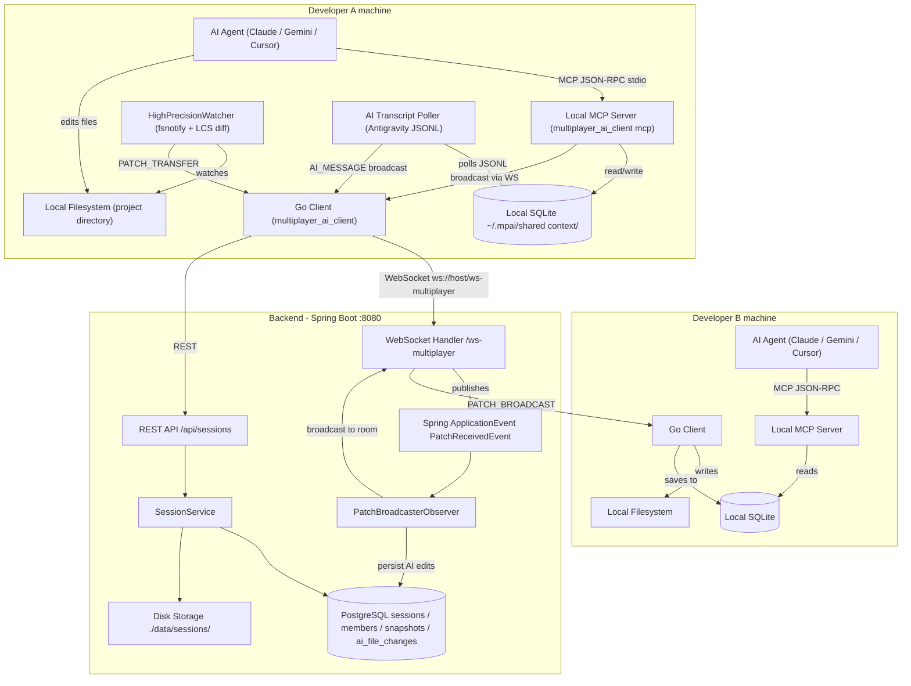

# Multiplayer AI

> Multiple developers can work with their own local AI coding agents while sharing a synchronized workspace and a persistent, locally-owned engineering context.

---

## Table of Contents

1. [Problem](#problem)
2. [What is Multiplayer AI?](#what-is-multiplayer-ai)
3. [Key Features](#key-features)
4. [Architecture](#architecture)
5. [Three Levels of Context](#three-levels-of-context)
6. [Shared Context Architecture](#shared-context-architecture)
7. [Collaboration Flow](#collaboration-flow)
8. [Distributed Systems Design](#distributed-systems-design)
9. [Event / Patch Model](#event--patch-model)
10. [Workspace Initialization](#workspace-initialization)
11. [Technology Stack](#technology-stack)
12. [Project Structure](#project-structure)
13. [Getting Started](#getting-started)
14. [Example Usage](#example-usage)
15. [Security and Privacy](#security-and-privacy)
16. [Current Limitations](#current-limitations)
17. [Roadmap](#roadmap)
18. [Design Decisions](#design-decisions)
19. [Testing](#testing)

---

## Problem

Modern AI coding tools — Claude Code, Gemini CLI, Cursor, Windsurf — work well for individual developers, but they are fundamentally single-player experiences:

- Each developer has their own isolated AI agent session and conversation context.
- When two developers work on the same codebase, their AI agents have no awareness of each other's reasoning, decisions, or in-flight changes.
- A file modified by one agent silently diverges from the other developer's local state.
- There is no shared layer through which agents can coordinate — each AI starts every task from scratch with only the filesystem as implicit context.
- Propagating AI-generated changes across a team requires manual communication, pull requests, and context re-establishment for every participant.

The result is that AI agents amplify individual productivity but do not compose well across a team working on a shared project.

---

## What is Multiplayer AI?

Multiplayer AI introduces a collaboration layer that sits alongside each developer's existing AI workflow rather than replacing it.

Each developer runs their preferred local AI coding agent (Claude Code, Gemini CLI, Cursor, Antigravity, etc.) exactly as they always have. The Multiplayer AI client runs in the background and provides three things:

1. **Shared Workspace Synchronization** — filesystem changes detected locally are propagated in real time to every other participant in the session via WebSocket patch broadcasts.

2. **Shared Engineering Context** — a local SQLite database on each machine stores the session's AI message history and file change log. This context is synchronized between participants when they connect, and updated continuously during the session.

3. **Local MCP Server** — the client binary doubles as an MCP (Model Context Protocol) server that AI agents can call to read the shared engineering context and broadcast their reasoning to teammates.

Developers do not need to change their tooling. The MCP server is auto-registered in the Antigravity IDE global config on startup, and workspace rule files (`.cursorrules`, `.clinerules`, `.cursor/rules/multiplayer.mdc`) are written automatically when a session starts, instructing compatible agents to consult the shared context before beginning work.

---

## Key Features

### Implemented

- **Session lifecycle management** — create, join, update (rename, change status), and delete sessions via CLI menu and REST API
- **Session owner limits** — configurable maximum active sessions per owner (default: 10) enforced server-side
- **Multi-user session membership** — tracked per session with roles (`OWNER`, `ADMIN`, `MEMBER`, `VIEWER`) and real-time connection status
- **Real-time filesystem synchronization** — `fsnotify`-based recursive directory watcher detects `CREATE`, `WRITE`, and `REMOVE` events and broadcasts line-level diffs to all session participants via WebSocket
- **LCS-based line-diff computation** — the watcher computes a true line-by-line diff (Longest Common Subsequence) before sending any patch, minimizing payload size
- **AI vs Human change attribution** — the watcher queries the OS for processes currently holding a write lock on the modified file and cross-references them against a known list of AI tool process names (`claude`, `gemini`, `cursor`, `windsurf`, `antigravity`, `cline`, etc.). Each patch is tagged with `isAiEdit` and `modifier`
- **Incoming patch suppression** — the watcher maintains a 2-second ignore window for paths being written by an incoming remote patch, preventing echo loops
- **Patch application** — received patches are applied locally using the same line-indexed diff format (whole-file overwrite or incremental add/remove)
- **Shared engineering context (SQLite)** — each participant maintains a local SQLite database at `~/.mpai/shared context/<sessionId>_<wdHash>/multiplayer_ai.db` storing AI messages and file change history for the session
- **Context synchronization on join** — when a participant connects, they send a `CONTEXT_REQUEST`; the session owner responds with up to 100 stored AI messages which the joiner writes to their local database
- **AI transcript polling** — a background goroutine polls the Antigravity IDE conversation transcript (JSONL format) every 1.5 seconds. New `PLANNER_RESPONSE` steps from the AI are saved locally and broadcast to other participants
- **Local MCP server** — the client executable acts as a stdio-based MCP 2.0 JSON-RPC server exposing four tools:
  - `get_active_session` — current session details matched by working directory hash
  - `get_session_messages` — chronological AI message history for the session
  - `get_file_changes_history` — file change log with actor attribution
  - `broadcast_ai_message` — send an AI message to all other participants via WebSocket
- **MCP auto-registration** — on every startup the client writes its own path into `~/.gemini/config/mcp_config.json` under the key `multiplayer-ai`
- **Workspace rule injection** — `.cursorrules`, `.clinerules`, and `.cursor/rules/multiplayer.mdc` are written on session join and cleaned up on exit (including `SIGTERM`/`Ctrl+C`)
- **Git workspace initialization** — for Git repos the session stores `git_repo_url`, `git_branch`, and `git_commit_sha`; joining members run `git checkout <branch>` to synchronize
- **Non-Git workspace initialization** — for plain directories the owner zips the current directory (up to 5 MB limit) and uploads a versioned snapshot; joining members download and extract the latest snapshot version
- **Snapshot versioning** — the server stores snapshot files on disk under `./data/sessions/<sessionId>/` and tracks metadata in a `snapshots` table with monotonically increasing version numbers
- **AI file change persistence (server)** — patches flagged as `isAiEdit` are persisted server-side in a PostgreSQL `ai_file_changes` table for audit purposes
- **Owner presence enforcement** — the WebSocket handler verifies that the session owner is currently connected before allowing non-owner clients to subscribe
- **Observer pattern for patch broadcasting** — incoming patches are published as Spring `ApplicationEvent` (`PatchReceivedEvent`) and picked up by `PatchBroadcasterObserver` and `PlainJsonWebSocketHandler`, decoupling receive from broadcast

### Planned / Not Yet Implemented

- Sequence numbers / causal ordering guarantees on patches
- Missed-event replay for reconnecting clients
- Redis Streams for cross-instance event routing
- Change approval / voting workflow before applying patches
- Authentication and authorization (current implementation is identity-by-user-ID string)
- Encryption in transit beyond standard TLS
- Conflict resolution beyond last-write-wins

---

## Architecture



### Go Client responsibilities

| Responsibility | Implementation |
|---|---|
| CLI session management menu | `menu/presentation.go` |
| REST calls to backend | `menu/backend.go` |
| WebSocket connection + subscription | `session/backend.go` |
| Recursive filesystem watching | `session/watcher.go` (`HighPrecisionWatcher`) |
| AI vs Human attribution | OS-level locking process inspection |
| LCS line diff computation | `session/watcher.go` (`computeLineDiff`) |
| Incoming patch application | `session/patch_applier.go` |
| SQLite context database | `contextengine/db.go` |
| AI transcript polling | `contextengine/poller.go` |
| MCP server (stdio JSON-RPC) | `contextengine/mcp.go` |
| MCP auto-registration | `contextengine/mcp_registry.go` |
| Workspace rule file management | `session/presentation.go` |
| Git info extraction | `menu/git_zip_helper.go` |
| Non-Git zip snapshot | `menu/git_zip_helper.go` |

### Spring Boot Backend responsibilities

| Responsibility | Implementation |
|---|---|
| Session CRUD | `SessionController` + `SessionService` |
| Session member tracking + presence | `SessionMemberEntity`, `SessionMemberRepository` |
| Owner session limit enforcement | `SessionService.createSession` |
| WebSocket room management | `PlainJsonWebSocketHandler` (`ConcurrentHashMap` per session) |
| Owner presence enforcement | `PlainJsonWebSocketHandler.handleTextMessage` |
| Patch event routing (Observer) | `PatchReceivedEvent` -> `PatchBroadcasterObserver` |
| AI edit persistence | `PatchBroadcasterObserver` -> `AiFileChangeEntity` |
| Snapshot upload / download | `SessionController` (multipart) + `FileStorageService` |
| Snapshot metadata versioning | `SnapshotEntity` + `SnapshotRepository` |

---

## Three Levels of Context

```
+------------------------------------------------------+
|  Level 3 - Private Agent Context                     |
|  (Claude / Gemini conversation, reasoning, memory)   |
|  NOT synchronized - intentionally isolated           |
+------------------+-----------------------------------+
                   |  MCP tools (get_session_messages,
                   |  get_file_changes_history,
                   |  broadcast_ai_message)
+------------------v-----------------------------------+
|  Level 2 - Shared Engineering Context                |
|  Local SQLite per participant                        |
|  - AI message history (transcript steps)             |
|  - File change log with actor attribution            |
|  - Active session metadata                           |
|  Synchronized: on join (bulk) + continuously (WS)   |
+------------------+-----------------------------------+
                   |  Real-time patch broadcasts (WebSocket)
+------------------v-----------------------------------+
|  Level 1 - Shared Workspace                          |
|  Project source files, tests, configuration          |
|  Synchronized via LCS line-diff patches over WS      |
+------------------------------------------------------+
```

Multiplayer AI deliberately does **not** attempt to synchronize Level 3. An AI agent's private conversation context is large, model-specific, and largely irrelevant to teammates. The system instead surfaces the _outcomes_ of that conversation (file changes and key messages) into Level 2, which all agents can read through MCP.

---

## Shared Context Architecture

### Why local-first SQLite

The shared engineering context is stored on each developer's machine, not on the server:

- **Agent accessibility** — MCP servers run as local processes. They need to read context synchronously without adding a network round-trip on every tool call. A local SQLite read takes microseconds; a REST call adds tens to hundreds of milliseconds of latency to every AI reasoning step.
- **Reduced server coupling** — the backend is a real-time relay. It does not need to understand or store engineering context.
- **Privacy boundary** — AI conversation content stays on local machines. The server only sees patch metadata (file paths, sender IDs, timestamps). The content of AI reasoning steps is never durably stored centrally.
- **Offline tolerance** — a developer can read their local context even when disconnected from the backend.

### How context is stored

The database path is deterministic:

```
~/.mpai/shared context/<sessionId>_<md5(workingDirectory)[:16]>/multiplayer_ai.db
```

The working directory hash allows the MCP server to locate the right database for the current project without any configuration. SQLite is opened in WAL journal mode with a 5-second busy timeout to allow concurrent reads from the MCP server while the client is writing incoming patches.

### How context is synchronized

1. **On join** — the joining client sends a `CONTEXT_REQUEST` WebSocket message to the session room. The session owner receives it, queries its local SQLite for up to 100 AI messages, and sends them back as a `CONTEXT_RESPONSE`. The joiner writes each received message using `INSERT OR IGNORE`, ensuring idempotency.

2. **Continuously during a session** — every AI transcript step polled from the Antigravity conversation log is broadcast as a `PATCH_TRANSFER` with `operation: AI_MESSAGE`. All other session participants receive it and save it to their local SQLite.

3. **File changes** — every filesystem patch (both outgoing and incoming) is saved to `file_changes` in the local database, building a continuous audit log visible through the `get_file_changes_history` MCP tool.

---

## Collaboration Flow

End-to-end walkthrough with two developers:

```
Developer A (session owner)                     Developer B (participant)
-------------------------------------------------------------------------

1. cd ~/project && ./multiplayer_ai_client --user alice
   Menu -> Create session "backend-refactor"
   Client detects Git repo (branch: main, commit: abc1234)
   POST /api/sessions -> session ID returned

2.                                               cd ~/project
                                                 ./multiplayer_ai_client --user bob
                                                 Menu -> Join session (by ID)
                                                 POST /api/sessions/{id}/join
                                                 Client detects Git repo
                                                 git checkout main

3. Menu -> Join own session
   Connects WebSocket /ws-multiplayer
   Sends SUBSCRIBE -> receives SUBSCRIBED
   Sends CONTEXT_REQUEST (no history yet)
   .cursorrules / .clinerules written

4.                                               WebSocket connected + SUBSCRIBED
                                                 Sends CONTEXT_REQUEST
                                                 Owner's client receives it,
                                                 queries SQLite (0 msgs yet),
                                                 sends CONTEXT_RESPONSE

5. Alice starts Antigravity IDE in ~/project
   Antigravity reads .cursorrules:
     "You MUST consult multiplayer-ai MCP before starting"
   AI calls get_active_session -> reads SQLite
   AI calls get_session_messages -> empty, session just started

6. AI (via Antigravity) modifies service/UserService.java
   HighPrecisionWatcher fires (fsnotify WRITE event)
   OS locking process check: "antigravity.exe" -> isAiEdit=true
   LCS diff computed (3 lines added, 1 removed)
   PATCH_TRANSFER sent over WebSocket with contentDelta JSON
   Saved to Alice's local SQLite file_changes

7. Backend receives PATCH_TRANSFER
   PlainJsonWebSocketHandler publishes PatchReceivedEvent
   PatchBroadcasterObserver broadcasts PATCH_BROADCAST to room
   AI edit flagged -> persisted to PostgreSQL ai_file_changes

8.                                               Bob's client receives PATCH_BROADCAST
                                                 sender != self -> apply patch
                                                 watcher.IgnorePath(absPath) 2-second window
                                                 ApplyPatch: reads file, applies add/remove lines
                                                 Saved to Bob's local SQLite file_changes
                                                 OK Applied patch for service/UserService.java

9. Antigravity transcript poller fires (every 1.5s)
   Reads new PLANNER_RESPONSE step from JSONL log
   HasAIMessage check -> not stored -> INSERT
   broadcastFn called -> PATCH_TRANSFER with operation: AI_MESSAGE

10.                                              Bob's client receives AI_MESSAGE broadcast
                                                 Saved to Bob's local SQLite ai_messages

11.                                              Bob starts his own AI agent
                                                 AI calls get_session_messages via MCP
                                                 MCP reads local SQLite
                                                 Returns Alice's AI reasoning steps
                                                 Bob's AI has shared engineering context
                                                 before writing a single line of code
```

---

## Distributed Systems Design

### Patch Broadcasting (Observer Pattern)

When a client sends a `PATCH_TRANSFER` message over WebSocket, the `PlainJsonWebSocketHandler` parses it and publishes a Spring `PatchReceivedEvent` to the application event bus. Two listeners pick this up independently:

- `PlainJsonWebSocketHandler.onPatchReceived` — iterates the `ConcurrentHashMap<UUID, Set<WebSocketSession>>` room map and delivers the broadcast to all open WebSocket connections for that session on this instance.
- `PatchBroadcasterObserver.handlePatchReceived` — additionally delivers via STOMP `SimpMessagingTemplate` to `/topic/session/{sessionId}` (for future STOMP clients) and persists AI-flagged patches to PostgreSQL.

This decoupling means new event consumers (metrics, logging, approval workflows) can be added without touching the handler.

### Presence Tracking via PostgreSQL

Because WebSocket connections are in-memory per JVM instance, presence state is written to the `session_members.is_connected` column in PostgreSQL on every connect and disconnect event. This makes presence visible across instances — any node can check whether the owner is connected before allowing subscribers by querying the database.

### Workspace Initialization Protocol (Non-Git)

```
Owner                         Backend                         Joiner
  |                              |                               |
  |-- POST /sessions/{id}/persist -->                            |
  |   (multipart zip, 5MB limit) |                               |
  |                              |-- stores to ./data/sessions/  |
  |                              |-- INSERT snapshots (version++)|
  |                              |                               |
  |                              |<-- GET /snapshots/{v}/download|
  |                              |                               |
  |                              |-- streams zip bytes ---------->|
  |                              |                               |-- CleanDirectory(.)
  |                              |                               |-- UnzipBytes(zipBytes, ".")
```

Zip extraction includes a Zip Slip check: every extracted path is verified to remain within the destination root before being written.

### What is Not Yet Implemented

| Problem | Current State | Impact |
|---|---|---|
| **Message ordering** | Patches carry a client-side millisecond timestamp. No sequence numbers are assigned server-side. | Concurrent edits to the same file from two clients can arrive out of order. |
| **Missed-event replay** | No checkpoint mechanism. Reconnecting clients miss patches sent during disconnection. | Workspace divergence after temporary network loss. |
| **Multi-instance event routing** | The `roomSessions` map is in-memory per JVM. Patches are not routed across instances. | A second backend instance cannot relay messages to clients on the first. |

These are the primary distributed systems problems targeted for v2 (see [Roadmap](#roadmap)).

---

## Event / Patch Model

### WebSocket Message

All client-to-server communication over `/ws-multiplayer` uses plain JSON:

| Field | Type | Description |
|---|---|---|
| `type` | string | `SUBSCRIBE`, `PATCH_TRANSFER`, `CONTEXT_REQUEST`, `CONTEXT_RESPONSE` |
| `status` | string | Server responses: `CONNECTED`, `SUBSCRIBED`, `PATCH_RECEIVED`, `PATCH_BROADCAST`, `ERROR` |
| `sessionId` | UUID | Target session identifier |
| `senderId` | UUID | User ID of the originating client |
| `timestamp` | int64 | Unix milliseconds (client clock) |
| `message` | string | Human-readable description or serialized payload |
| `patches` | `[]FilePatchItem` | Array of file patch descriptors |
| `error` | string | Error description on `ERROR` status |

### Patch Item

| Field | Type | Description |
|---|---|---|
| `filePathFromRoot` | string | Relative path from the watched directory root |
| `fileName` | string | Filename including extension |
| `fileExtension` | string | Extension only (e.g. `.go`) |
| `operation` | string | `CREATE`, `WRITE`, `REMOVE`, `AI_MESSAGE` |
| `sizeBytes` | int64 | File size at time of change |
| `modifier` | string | `"User"`, `"AI (via claude.exe)"`, `"AI (via Antigravity IDE.exe)"` |
| `isAiEdit` | bool | True if the modifying process matched the known AI tool process list |
| `isRevert` | bool | True if this patch is reverting a previous change |
| `isWholeFile` | bool | True when no prior snapshot exists or change covers >50 lines with no equal context |
| `contentDelta` | string | JSON-encoded diff: `{added:[{lineNum,text}], removed:[{lineNum,text}]}` |
| `fileChanges` | string | Raw content (backwards-compatible field for whole-file cases and AI messages) |

### Idempotency

- **AI messages** use `INSERT OR IGNORE` keyed on `(session_id, step_index)`. The poller calls `HasAIMessage` before broadcasting, so replaying the transcript does not produce duplicate broadcasts.
- **File changes** use `INSERT OR IGNORE` on a UUID primary key generated at emit time. There is no deduplication on file patches currently.

---

## Workspace Initialization

### Git Repository

1. `GetGitInfo()` runs `git rev-parse --is-inside-work-tree` to confirm Git presence
2. `git config --get remote.origin.url`, `git rev-parse --abbrev-ref HEAD`, and `git rev-parse HEAD` extract repo URL, branch, and commit SHA
3. These are stored in `sessions.git_repo_url`, `sessions.git_branch`, `sessions.git_commit_sha` via `PATCH /api/sessions/{id}`
4. Joining members read these fields and run `git checkout <branch>` locally

No file content is transferred over the backend for Git sessions.

### Non-Git Directory

1. `ZipDirectory(".")` creates an in-memory ZIP, skipping `.git`, hidden dirs, `node_modules`, `target`, `bin`, `obj`, `dist`, `.idea`, `.gradle`, `.exe` binaries, and the client binary
2. Archive is size-checked (5 MB hard limit)
3. `POST /api/sessions/{id}/persist` uploads the ZIP as multipart form data
4. Server writes to `./data/sessions/<sessionId>/snapshot_v<version>.zip` and inserts a `snapshots` record
5. Joining members call `GET /api/sessions/{id}/snapshots/{version}/download`
6. `CleanDirectory(".")` removes all files except the client binary, `config.json`, and hidden files
7. `UnzipBytes(zipBytes, ".")` extracts with path traversal validation

---
