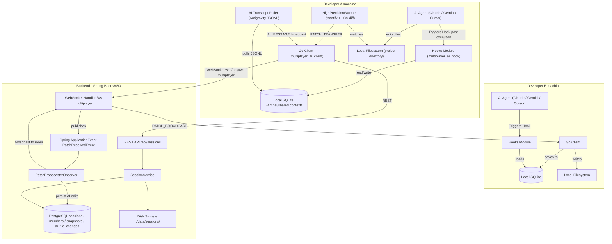

# Multiplayer AI

> **Enable multiple developers to work with their own local AI coding agents while sharing a synchronized workspace and a persistent, locally-owned engineering context.**

---

## 🎯 Why I Built This

The idea for Multiplayer AI started with a **Y Combinator Request for Startups** focused on multiple people collaborating with an AI agent while sharing the same context.

I found the problem interesting because it combines **AI agents, collaboration, and distributed systems**. I decided to attempt building it by exploring a local-first approach:

> **What if the shared context lived on users’ local machines and was synchronized between them?**

This led me to build a coordination layer that synchronizes filesystem changes, maintains shared AI context, and allows multiple clients to participate in the same session while continuing to use their preferred local AI tools.

Through this attempt, I explored challenges including **real-time synchronization, event ordering, missed-event recovery, concurrent changes, and maintaining consistent state across clients**.

The goal was to investigate whether multiple local AI workflows could behave like a shared, multiplayer AI session.


---

## 💡 What It Does

* **Real-Time Workspace Sync:** Synchronizes file changes across participants in real time, keeping shared workspaces consistent.

* **Change Attribution:** Identifies whether a change originated from a developer or an AI coding agent and preserves that attribution across the session.

* **Shared AI Context:** Maintains and synchronizes conversation history and workspace changes, giving participants a shared view of the ongoing work.

* **AI Context Integration:** Connects local AI coding tools to the shared context, allowing agents to access relevant work and decisions made by other participants.

* **Automatic Agent Configuration:** Configures supported AI tools when joining a session so they can participate in the shared workflow without manual setup.

* **Workspace Initialization:** Automatically brings new participants up to date through Git-based synchronization or secure workspace snapshots.

---

## 🏗️ Architecture

Show the system at a high level.



### Key Components

| Component | Responsibility |
| --- | --- |
| **Go Client (`multiplayer_ai_client`)** | Handles recursive directory watching, LCS line-diff calculation, patch application, and local SQLite data storage. Runs background tasks like transcript polling. |
| **Spring Boot Backend** | Serves as the central command-and-control server. Implements session REST APIs, manages WebSocket connections and room subscriptions, tracks active member presence, and handles ZIP snapshot storage. |
| **Local SQLite Database** | A low-latency local database storing session metadata, message transcripts, and file change logs so local AI agents can access context instantly without network latency. |
| **PostgreSQL Database** | Persistent storage for backend metadata, including active session configurations, member roles/presence, zip snapshot versions, and AI file change audit logs. |
| **Hooks Module (`multiplayer_ai_hook`)** | A CLI hook triggered after IDE/agent execution. Locates session context and injects ephemeral messages or shared database updates back into the local agent's workspace. |

---

## 🛠️ Tech Stack

**Languages:** Go, Java

**Backend:** Spring Boot 4.1.0, Spring Web MVC, Spring WebSocket

**Databases:** PostgreSQL (Backend metadata), SQLite (Client local-first shared context)

**Libraries & Protocols:** Workspace Agent Hooks, `fsnotify` (Go file watching), Lombok, JDBC / JPA

**Workspace Tools:** Git integration, ZIP compression utilities

---
## 🔄 How It Works

```text
File Changed (User/AI Edit)
             ↓
Watcher Detects Event (fsnotify)
             ↓
Modifier Attributed (Process Lock Check)
             ↓
LCS Line Diff Computed
             ↓
PATCH_TRANSFER Sent (WebSockets)
             ↓
Backend Relays Message (Observer Event Bus)
             ↓
PATCH_BROADCAST Received by Peer
             ↓
Ignore Window Applied (Echo Suppression)
             ↓
Patch Written to Disk & Logged in SQLite
```

1. **Change Detection:** A file within the workspace is modified (either by the user or an AI agent). The Go client's `HighPrecisionWatcher` detects the change via recursive `fsnotify` events.
2. **Attribution & Diffing:** The client queries the OS to check if an AI process holds a lock on the file. It then computes the exact line differences using a Longest Common Subsequence (LCS) algorithm.
3. **Transmission:** The client wraps the patch details (including file delta, attribution, and timestamp) in a `PATCH_TRANSFER` JSON payload and sends it over the active WebSocket room.
4. **Relay & Persistence:** The Spring Boot backend receives the message, publishes a `PatchReceivedEvent`, and routes the message to all other participants subscribed to the session. If the edit was made by an AI, it is also logged in PostgreSQL for audit purposes.
5. **Application:** Other connected clients receive the `PATCH_BROADCAST` message. They add the target path to their ignore-window to prevent echo loops, apply the patch line-by-line to the local filesystem, and insert a log of the edit into their local SQLite database for context tracking.

---

## 🚀 Running Locally

### Prerequisites

* Java 21 JDK
* Maven 3+
* Go 1.21+
* PostgreSQL server (running locally on port 5432)

### Setup

```bash
git clone https://github.com/888Sourav888/Multiplayer_AI_System.git
cd Multiplayer_AI_System
```

### Configuration

#### Backend Service Configuration
Configure your database connection inside `service/src/main/resources/application.properties`:
```properties
spring.datasource.url=jdbc:postgresql://localhost:5432/MultiplayerAI
spring.datasource.username=postgres
spring.datasource.password=mydatabase
server.port=8080
app.storage.base-dir=./data/sessions
```
*Create the database `MultiplayerAI` in your PostgreSQL instance before launching.*

#### Client Configuration
Edit `client/config.json` next to the client binary directory:
```json
{
  "lowerEnvBackendURL": "http://localhost:8080",
  "prodBackendURL": ""
}
```

### Run

#### 1. Start the Backend Service
```bash
cd service
./mvnw spring-boot:run
```

#### 2. Compile the Hook Module
The hook module must be compiled to an executable within the workspace so client session rules can trigger it post-invocation:
```bash
cd ../HooksModule
go build -o multiplayer_ai_hook.exe
```

#### 3. Build & Launch the Client CLI
Compile and run the Go client to join or create sessions:
```bash
cd ../client
go build -o multiplayer_ai_client.exe
./multiplayer_ai_client.exe --user alice
```

---

## 📁 Project Structure

```text
Multiplayer_AI_System/
├── client/                      # Go Client codebase
│   ├── contextengine/           # SQLite context sync and logging
│   ├── menu/                    # Interactive CLI menu & REST client
│   ├── session/                 # fsnotify watcher & patch applier
│   ├── ui/                      # ANSI terminal styling elements
│   ├── config.json              # Client backend settings
│   └── main.go                  # Client entry point
├── service/                     # Spring Boot Backend codebase
│   ├── src/
│   │   ├── main/
│   │   │   ├── java/            # Spring controllers, services, handlers
│   │   │   └── resources/       # Application configuration & static assets
│   │   └── test/                # JUnit & Spring Integration tests
│   └── pom.xml                  # Maven build configuration
├── HooksModule/                 # Post-invocation hooks for IDE/agent injection
└── database_entities.md         # Database schema descriptions
```

Briefly explain only the important directories:
* `client/`: Hosts all Go source files responsible for the user client CLI, process detection, and file synchronizer.
* `service/`: Contains the Java Spring Boot application implementing WebSocket logic, persistence triggers, and CRUD REST APIs.
* `HooksModule/`: Handles post-invocation routines written in Go to intercept and inject ephemeral context into local IDE rules.

---

## 🧪 Testing

Describe the testing strategy.

### Running Backend Tests
Execute the JUnit test suite via Maven:
```bash
cd service
./mvnw test
```

* **SessionServiceTest:** Validates session creation, user joining, snapshot versioning, and owner limit checks.
* **ServiceApplicationTests:** Verifies application context loading and auto-configuration.
* **stomp-test.html:** Web-based interface located in `service/src/main/resources/static` to manually verify WebSocket and STOMP message broadcasting.

---

## 🔮 List of Items Planned to be Added in Future

* **Patch Ordering & Causal Guarantees:** Implement server-side sequence numbering or vector clocks to guarantee correct causal ordering when multiple developers edit concurrently.
* **Missed-Event Replay:** Build a checkpoint-based event log on the server so that clients reclaiming connection after a network drop can catch up on missing patches.
* **Cross-Instance Event Routing:** Integrate Redis Streams to support routing WebSocket broadcasts across multiple containerized instances of the Spring Boot backend.
* **Change Voting/Approval Workflows:** Add a CLI/UI prompt allowing developers to approve or reject incoming AI edits before they are automatically applied to their active directories.
